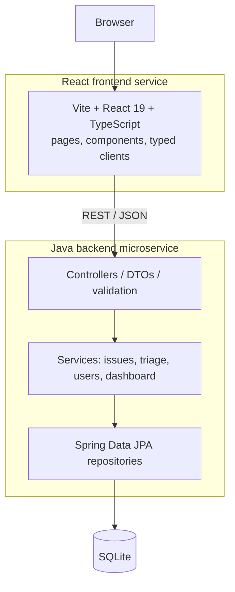

# IssueFlow

**React frontend** plus **Java backend microservice**.

IssueFlow is an incident and support issue triage application. The UI is a React / TypeScript SPA. The API is a standalone Java 17 Spring Boot REST service. They live in one repository, run as two processes, and talk only over HTTP JSON.

The UI never owns priority. The backend scores each issue, assigns a P1 through P4 band, and returns the contributing factors so the UI can explain the result.

[UI](http://localhost:3000) · [API](http://localhost:8080) · [Swagger](http://localhost:8080/swagger-ui/index.html)


## Why it exists

IssueFlow is an interview demonstration of a compact full-stack architecture: a React frontend and a Java 17 / Spring Boot backend microservice, with SQLite persistence.

It is small enough to finish in a weekend, and complete enough to show:

- a React single-page application with typed API clients, routing, forms, and tests
- a Java REST microservice with layered architecture, validation, business rules, and OpenAPI docs
- meaningful domain logic beyond CRUD (triage scoring, status transitions, assignment, audit history)

It is not a production enterprise platform. Authentication, cloud deployment, and extra infrastructure were intentionally left out so the demo stays explainable.

## Architecture

One repository, two independently runnable services:

1. **React frontend** on `http://localhost:3000` (Vite SPA)
2. **Java backend microservice** on `http://localhost:8080` (Spring Boot REST)

Each has its own runtime, build, and tests. The frontend never reaches the database. The backend never renders HTML. The contract between them is the REST API documented in Swagger.

```text
Browser
   |
   v
+----------------------------------+
|  React Frontend Service          |
|  TypeScript / Vite / Yarn        |
|  http://localhost:3000           |
|                                  |
|  pages, components, typed API    |
+----------------+-----------------+
                 |
                 | REST / JSON
                 | CORS: localhost:3000 -> localhost:8080
                 v
+----------------------------------+
|  Java Backend Microservice       |
|  Spring Boot 3 / Java 17 / Maven |
|  http://localhost:8080           |
|                                  |
|  Controller -> Service -> JPA    |
+----------------+-----------------+
                 |
                 | JPA / Hibernate
                 v
+----------------------------------+
|  SQLite                          |
|  backend/data/issueflow.db       |
+----------------------------------+
```



### React frontend service

Standalone SPA in `frontend/`. Yarn, Vite, and Vitest. Talks to the backend only through `frontend/src/api/`.

- Dashboard statistics and highest-priority open issues
- Issue list with search and filters
- Create and edit issues
- Detail view with status changes, assignment, triage explanation, and history
- Users page for assignable team members
- Loading, empty, validation, and error states

### Java backend microservice

Standalone Spring Boot REST service in `backend/`. Maven Wrapper, JUnit 5, and Swagger UI.

- REST controllers accept request DTOs and return response DTOs (entities are not exposed)
- Services own issue lifecycle, assignment, status transitions, and history
- `TriageService` calculates priority scores and explanations
- Jakarta Bean Validation at the API boundary
- Centralized JSON error responses
- SQLite persistence with automatic seed data on first start

## Technology stack

| Layer | Stack |
|---|---|
| Frontend service | React 19, TypeScript, Vite, React Router, Yarn, Vitest, React Testing Library |
| Backend service | Java 17, Spring Boot 3.4, Spring Web, Spring Data JPA, Jakarta Validation, Maven |
| Persistence | SQLite, Hibernate |
| API contract | REST / JSON, springdoc OpenAPI, Swagger UI |
| Tests | JUnit 5, Mockito, Spring Boot Test, Vitest |

## What the application does

Users can create, review, prioritize, assign, update, and resolve software incidents.

| Surface | Behavior |
|---|---|
| Dashboard | Open, critical, in-progress, and resolved counts plus highest-priority open issues |
| Issues | Filter by status, priority, severity, category, assignee, and text search |
| New / edit issue | Client and server validation. Priority is calculated by the backend, not chosen in the form |
| Issue detail | Status workflow, assignment, triage explanation, recalculate triage, history timeline |
| Users | List and create assignable team members |

## REST API

Base URL: `http://localhost:8080`

| Method | Path | Purpose |
|---|---|---|
| GET | `/api/dashboard` | Dashboard statistics |
| GET | `/api/issues` | List issues with optional filters |
| POST | `/api/issues` | Create an issue and auto-triage it |
| GET | `/api/issues/{id}` | Issue detail |
| PUT | `/api/issues/{id}` | Update an issue |
| DELETE | `/api/issues/{id}` | Delete an issue |
| PATCH | `/api/issues/{id}/status` | Forward-only status change |
| PATCH | `/api/issues/{id}/assign` | Assign or unassign |
| POST | `/api/issues/{id}/triage` | Recalculate priority |
| GET | `/api/issues/{id}/history` | Audit history |
| GET | `/api/users` | List users |
| GET | `/api/users/{id}` | User detail |
| POST | `/api/users` | Create a user |

Interactive docs: [http://localhost:8080/swagger-ui/index.html](http://localhost:8080/swagger-ui/index.html)

The frontend navigation includes an API Docs link to that URL.

## Running locally

No Docker, no cloud, no extra processes. Start the backend service, then the frontend service.

### 1. Java backend service

Requires JDK 17.

```bash
cd backend
./mvnw spring-boot:run
```

The API listens on `http://localhost:8080`.

SQLite is created at `backend/data/issueflow.db` on first start. Seed data loads automatically when the database is empty: 5 users and 20 issues. Additional users can be created from the Users page.

### 2. React frontend service

Requires Node.js 18+.

```bash
cd frontend
yarn
yarn dev
```

The UI is available at `http://localhost:3000`.

Optional environment variable:

```text
VITE_API_BASE_URL=http://localhost:8080
```

Copy `.env.example` or `frontend/.env.example` if you want a local file. The frontend defaults to `http://localhost:8080` when the variable is not set.

## Running tests

Frontend service:

```bash
cd frontend
yarn test
```

Backend service:

```bash
cd backend
./mvnw test
```

Full backend verification:

```bash
cd backend
./mvnw clean verify
```

Frontend production build:

```bash
cd frontend
yarn build
```

## Triage business logic

Priority is never chosen by the user during normal create or edit flows. The backend service calculates a score from issue characteristics:

| Condition | Score |
|---|---:|
| Production impact | +50 |
| Critical severity | +40 |
| High severity | +25 |
| Medium severity | +10 |
| Customer facing | +20 |
| 100 or more affected users | +20 |
| 25 to 99 affected users | +10 |
| Older than 24 hours and unresolved | +10 |

Priority bands:

| Score | Priority |
|---|---|
| 90 or greater | P1 |
| 60 to 89 | P2 |
| 30 to 59 | P3 |
| 0 to 29 | P4 |

The API returns both the score and the contributing factors so the UI can show why a priority was assigned. Recalculating triage writes history when the priority changes.

Issue status follows a simple forward path:

```text
NEW -> TRIAGED -> IN_PROGRESS -> RESOLVED -> CLOSED
```

Invalid jumps, such as moving a closed issue back to in progress, are rejected.

## SQLite behavior

- The runtime database file is local and gitignored.
- Hibernate updates the schema on startup.
- Restarting the application reuses existing data and does not duplicate seed records.
- Cloning the repository and starting the backend is enough to get a populated demo.

## Intentional scope limits

The first version does not include authentication, user registration, email notifications, WebSockets, Redis, Docker, or cloud deployment. Those omissions keep the demo explainable.

The architecture is a React frontend and a Java backend microservice. Extra backend services, message brokers, and orchestration were deliberately not added.

## Project layout

```text
issueflow/
├── README.md
├── .gitignore
├── .env.example
├── frontend/          React frontend service
│   ├── package.json
│   ├── yarn.lock
│   └── src/
└── backend/           Java backend microservice
    ├── pom.xml
    ├── mvnw
    └── src/
```
