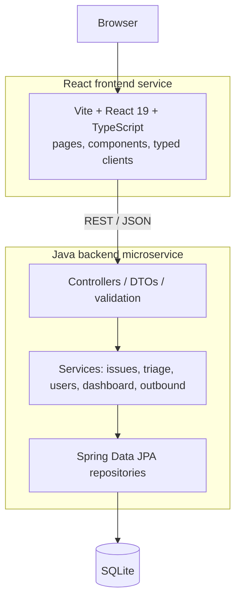
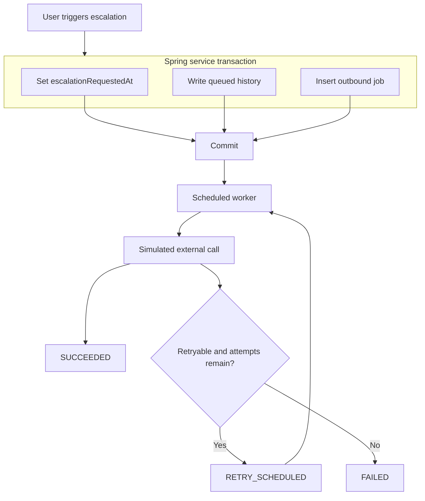

# IssueFlow

**React frontend** plus **Java backend microservice**.

IssueFlow is an incident and support issue triage application. The UI is a React / TypeScript SPA. The API is a standalone Java 17 Spring Boot REST service. They live in one repository, run as two processes, and talk only over HTTP JSON.

The UI never owns priority. The backend scores each issue, assigns a P1 through P4 band, and returns the contributing factors so the UI can explain the result.

[UI](http://localhost:3000) · [API](http://localhost:8080) · [Swagger](http://localhost:8080/swagger-ui/index.html)


## Why it exists

IssueFlow is an interview demonstration of a compact full-stack architecture: a React frontend and a Java 17 / Spring Boot backend microservice, with SQLite persistence.

It is small enough to finish in a weekend, and complete enough to show:

- a React single-page application with typed API clients, routing, forms, and tests
- a Java REST microservice with layered architecture, validation, business rules, and OpenAPI docs
- meaningful domain logic beyond CRUD (triage scoring, status transitions, assignment, audit history)
- a durable SQLite-backed outbound notification workflow with bounded retries and idempotency

It is not a production enterprise platform. Authentication, cloud deployment, and extra infrastructure were intentionally left out so the demo stays explainable.

## Architecture

One repository, two independently runnable services:

1. **React frontend** on `http://localhost:3000` (Vite SPA)
2. **Java backend microservice** on `http://localhost:8080` (Spring Boot REST)

Each has its own runtime, build, and tests. The frontend never reaches the database. The backend never renders HTML. The contract between them is the REST API documented in Swagger.

```text
Browser
   |
   v
+----------------------------------+
|  React Frontend Service          |
|  TypeScript / Vite / Yarn        |
|  http://localhost:3000           |
|                                  |
|  pages, components, typed API    |
+----------------+-----------------+
                 |
                 | REST / JSON
                 | CORS: localhost:3000 -> localhost:8080
                 v
+----------------------------------+
|  Java Backend Microservice       |
|  Spring Boot 3 / Java 17 / Maven |
|  http://localhost:8080           |
|                                  |
|  Controller -> Service -> JPA    |
+----------------+-----------------+
                 |
                 | JPA / Hibernate
                 v
+----------------------------------+
|  SQLite                          |
|  backend/data/issueflow.db       |
+----------------------------------+
```



### React frontend service

Standalone SPA in `frontend/`. Yarn, Vite, and Vitest. Talks to the backend only through `frontend/src/api/`.

- Dashboard statistics and highest-priority open issues
- Issue list with search and filters
- Create and edit issues
- Detail view with status changes, assignment, triage explanation, outbound notification status, and history
- Users page for assignable team members
- Loading, empty, validation, and error states

### Java backend microservice

Standalone Spring Boot REST service in `backend/`. Maven Wrapper, JUnit 5, and Swagger UI.

- REST controllers accept request DTOs and return response DTOs (entities are not exposed)
- Services own issue lifecycle, assignment, status transitions, history, and outbound job creation
- `TriageService` calculates priority scores and explanations
- A scheduled worker processes durable outbound jobs after commit
- Jakarta Bean Validation at the API boundary
- Centralized JSON error responses
- Log4j2 structured JSON logs for HTTP, issue workflow, and outbound retries
- SQLite persistence with automatic seed data on first start

## Technology stack

| Layer | Stack |
|---|---|
| Frontend service | React 19, TypeScript, Vite, React Router, Yarn, Vitest, React Testing Library |
| Backend service | Java 17, Spring Boot 3.4, Spring Web, Spring Data JPA, Jakarta Validation, Maven, Log4j2 |
| Persistence | SQLite, Hibernate |
| API contract | REST / JSON, springdoc OpenAPI, Swagger UI |
| Tests | JUnit 5, Mockito, Spring Boot Test, Vitest |
| Logs | Log4j2 JSON (Logstash format) on stdout for Splunk or New Relic style dashboards |

## What the application does

Users can create, review, prioritize, assign, update, and resolve software incidents.

| Surface | Behavior |
|---|---|
| Dashboard | Open, critical, in-progress, and resolved counts plus highest-priority open issues |
| Issues | Filter by status, priority, severity, category, assignee, and text search |
| New / edit issue | Client and server validation. Priority is calculated by the backend, not chosen in the form |
| Issue detail | Status workflow, assignment, triage explanation, recalculate triage, escalation notification status, history timeline |
| Users | List and create assignable team members |

## REST API

Base URL: `http://localhost:8080`

| Method | Path | Purpose |
|---|---|---|
| GET | `/api/dashboard` | Dashboard statistics |
| GET | `/api/issues` | List issues with optional filters |
| POST | `/api/issues` | Create an issue and auto-triage it |
| GET | `/api/issues/{id}` | Issue detail |
| PUT | `/api/issues/{id}` | Update an issue |
| DELETE | `/api/issues/{id}` | Delete an issue |
| PATCH | `/api/issues/{id}/status` | Forward-only status change |
| PATCH | `/api/issues/{id}/assign` | Assign or unassign |
| POST | `/api/issues/{id}/triage` | Recalculate priority |
| GET | `/api/issues/{id}/history` | Audit history |
| POST | `/api/issues/{id}/escalation-notification` | Queue an idempotent escalation notification |
| GET | `/api/issues/{id}/outbound-jobs` | List outbound jobs for an issue |
| GET | `/api/outbound-jobs/{jobId}` | Outbound job detail |
| GET | `/api/users` | List users |
| GET | `/api/users/{id}` | User detail |
| POST | `/api/users` | Create a user |

Interactive docs: [http://localhost:8080/swagger-ui/index.html](http://localhost:8080/swagger-ui/index.html)

The frontend navigation includes an API Docs link to that URL.

## Running locally

No Docker, no cloud, no extra processes. Start the backend service, then the frontend service.

### 1. Java backend service

Requires JDK 17.

```bash
cd backend
./mvnw spring-boot:run
```

The API listens on `http://localhost:8080`.

SQLite is created at `backend/data/issueflow.db` on first start. Seed data loads automatically when the database is empty: 5 users and 20 issues. Additional users can be created from the Users page.

### 2. React frontend service

Requires Node.js 22+.

```bash
cd frontend
yarn
yarn dev
```

The UI is available at `http://localhost:3000`.

Optional environment variable:

```text
VITE_API_BASE_URL=http://localhost:8080
```

Copy `.env.example` or `frontend/.env.example` if you want a local file. The frontend defaults to `http://localhost:8080` when the variable is not set.

Backend outbound settings live in `backend/src/main/resources/application.yml` and can be overridden with environment variables documented in Configuration below. The default simulation mode is `FAIL_ONCE_THEN_SUCCEED` so a first demo attempt fails with HTTP 503 and the next attempt succeeds.

## Running tests

Frontend service:

```bash
cd frontend
yarn test
```

Backend service:

```bash
cd backend
./mvnw test
```

Full backend verification:

```bash
cd backend
./mvnw clean verify
```

Frontend production build:

```bash
cd frontend
yarn build
```

## Triage business logic

Priority is never chosen by the user during normal create or edit flows. The backend service calculates a score from issue characteristics:

| Condition | Score |
|---|---:|
| Production impact | +50 |
| Critical severity | +40 |
| High severity | +25 |
| Medium severity | +10 |
| Customer facing | +20 |
| 100 or more affected users | +20 |
| 25 to 99 affected users | +10 |
| Older than 24 hours and unresolved | +10 |

Priority bands:

| Score | Priority |
|---|---|
| 90 or greater | P1 |
| 60 to 89 | P2 |
| 30 to 59 | P3 |
| 0 to 29 | P4 |

The API returns both the score and the contributing factors so the UI can show why a priority was assigned. Recalculating triage writes history when the priority changes.

Issue status follows a simple forward path:

```text
NEW -> TRIAGED -> IN_PROGRESS -> RESOLVED -> CLOSED
```

Invalid jumps, such as moving a closed issue back to in progress, are rejected.

## Reliable outbound notification

IssueFlow includes a compact transactional outbox and retry workflow for a simulated external escalation notification.

The failure scenario is the same class of problem as a payment or other side-effecting call: the remote operation may succeed even if IssueFlow never sees the response. Blindly retrying can create duplicate side effects. This demo shows how to validate first, persist intent with the business change, retry only transient failures, and reuse a stable idempotency key.

It is not a payment platform. The simulated client never leaves the process and never talks to a real third party.

### Why the call is not made inside the business transaction

Calling an external service while the database transaction is still open is unsafe. If the remote call succeeds and then IssueFlow crashes before commit, the local state is lost. If the local commit succeeds and then the process dies before the remote call, the notification is forgotten.

IssueFlow does this instead:

1. Persist the business state change (`escalationRequestedAt` on the issue).
2. Persist the outbound job in the same database transaction.
3. Commit.
4. Let a separate scheduled worker perform the simulated external call.



The worker claims a due job, calls the simulator outside the database transaction, then records success, a scheduled retry, or permanent failure.

### Failure classes

- Validation failure: the request never creates outbound work. Closed issues are rejected. Missing issues return 404.
- Retryable outbound failure: timeout, other transient transport failures (connection refused, connection timeout, read timeout, socket reset, DNS failure, unreachable host), HTTP 408, 429, 500, 502, 503, or 504. The job is scheduled again with bounded backoff.
- Permanent outbound failure: HTTP 400, 401, 403, 404, 409, 422, other non-retryable 4xx, or retry exhaustion. The job moves to `FAILED`.

The worker classifies application-level outbound exceptions. `OutboundTransportException` and `OutboundTimeoutException` are retryable. HTTP-library exceptions stay inside the external client adapter and are translated there.

### Idempotency

Each logical escalation uses a stable key: `ESCALATION_NOTIFICATION:{issueId}`. The key does not include the attempt number. Repeating the trigger returns the existing job. The simulated service treats a repeated key as the same logical operation and does not record a second side effect.

This is at-least-once retry with idempotent handling. It is not exactly-once delivery.

The external operation may succeed even if IssueFlow does not receive the response. Retry attempts therefore reuse the same idempotency key so the same logical operation cannot create duplicate simulated side effects.

### Retry policy

Default maximum: 5 attempts. Attempt 1 runs as soon as the worker sees the job. Later delays are 5s, 15s, 45s, then 120s. Values are configurable.

| Failure | Retry? | Behavior |
|---|---|---|
| Transient transport failure | Yes | Retry with bounded backoff |
| Network timeout | Yes | Retry with bounded backoff |
| HTTP 408 | Yes | Retry with bounded backoff |
| HTTP 429 | Yes | Honor `Retry-After` when provided, capped at 120 seconds |
| HTTP 500/502/503/504 | Yes | Retry with bounded backoff |
| HTTP 400 | No | Fail immediately |
| HTTP 401/403 | No | Fail immediately |
| HTTP 404 | No | Fail immediately |
| HTTP 409 | No | Fail immediately |
| HTTP 422 | No | Fail immediately |
| Retry limit exhausted | No | Mark permanently failed |

HTTP 409 is treated as a permanent remote conflict for this demo. Repeated calls with an already accepted idempotency key return success from the simulator rather than 409.

### Restart durability

Retry state lives in SQLite, not in memory. Status, attempt count, next attempt time, last error, and idempotency key are columns on `outbound_jobs`.

If the backend stops after a retry is scheduled:

1. The job fails with a retryable condition and the worker writes that state to SQLite.
2. The application can stop. The `outbound_jobs` row remains.
3. The application starts again and does not recreate the job.
4. The worker queries due jobs from the database.
5. Processing resumes using the persisted attempt metadata.

The simulated client keeps process-local attempt counters for modes such as `FAIL_ONCE_THEN_SUCCEED`. Those counters reset when the process exits, so that mode will fail again after a restart instead of succeeding. Use `ALWAYS_503` or `ALWAYS_TIMEOUT` for the restart demonstration. Those modes do not depend on in-memory attempt counts. The durable truth is the job row.

### History and UI

Issue history records queued, failed attempt, retry scheduled, succeeded, and permanently failed events. The Issue Detail page shows job status, attempt count, last HTTP status, last safe error, next retry time, completion time, and the idempotency key. The UI does not decide whether to retry. It can refresh manually and polls while a job is pending, processing, or retry-scheduled.

Closed issues cannot queue a new escalation notification.

## SQLite behavior

- The runtime database file is local and gitignored.
- Hibernate updates the schema on startup.
- If an older local database still has a stale `issue_history` event-type check constraint, IssueFlow rebuilds that table on startup while keeping existing rows.
- Restarting the application reuses existing data and does not duplicate seed records.
- Cloning the repository and starting the backend is enough to get a populated demo.
- The `outbound_jobs` table is created by Hibernate on startup. Seed data does not create outbound jobs. Trigger them from Issue Detail.

## Retry demo scenarios

Default simulation mode is `FAIL_ONCE_THEN_SUCCEED`. Use an open issue on the Issue Detail page.

1. Successful retry after a transient failure: click Queue escalation notification. The first worker attempt records HTTP 503, schedules a retry, then succeeds on attempt 2. Watch status, attempt count, and issue history. The idempotency key stays `ESCALATION_NOTIFICATION:{issueId}`.
2. Successful first attempt: set `ISSUEFLOW_OUTBOUND_SIMULATION_MODE=ALWAYS_SUCCEED`, restart the backend, and trigger on a different issue.
3. Non-retryable failure: set `ISSUEFLOW_OUTBOUND_SIMULATION_MODE=ALWAYS_400`, restart, and trigger. The job fails on attempt 1 with HTTP 400 and is not retried.
4. Retry exhaustion: set `ISSUEFLOW_OUTBOUND_SIMULATION_MODE=ALWAYS_503`, restart, and trigger. After 5 attempts the job is `FAILED`.
5. Stable idempotency: trigger the same issue twice. The second request returns the same `jobId` and key. No second logical job is created.
6. History and UI: queued, failed attempt, retry scheduled, and succeeded or failed events appear on the Issue Detail timeline and outbound panel.
7. Restart durability: set `ISSUEFLOW_OUTBOUND_SIMULATION_MODE=ALWAYS_503`, restart the backend, and trigger on an open issue. Wait until the job is `RETRY_SCHEDULED` with attempt count 1, a next attempt time, last HTTP 503, and last error stored. Stop the backend. The job row remains in SQLite. Start the backend again. After `nextAttemptAt`, the worker claims the persisted job and continues from the stored attempt metadata. The simulator still returns HTTP 503 because `ALWAYS_503` does not use process-local counters. The attempt count becomes 2 and another retry is scheduled.

Do not use `FAIL_ONCE_THEN_SUCCEED` to demonstrate restart. That mode counts attempts in memory, so a restarted process treats the next call as attempt 1 and fails again instead of succeeding.

Do not wait on automated tests for real backoff intervals. Tests invoke the worker directly.

## Operational logs

The backend uses Log4j2 and writes one JSON object per line to stdout in Logstash format. Each operational event has a stable `event` name and low-cardinality fields so a log platform can chart rates, latency, and failure mix without parsing free-form text.

The demo does not ship Splunk, New Relic, or an APM agent. Point those tools at stdout, a file, or a collector when you want dashboards.

Correlation:

- `requestId` is set for the life of an HTTP request and appears on logs emitted during that request.
- Outbound worker attempts are async, so they correlate on `jobId`, `issueId`, and `idempotencyKey` rather than `requestId`.

HTTP:

| Event | When | Dashboard use |
|---|---|---|
| `http.request` | After each API request | Request rate, error rate, and latency by `httpRoute` |
| `http.error` | Unexpected 500s | 5xx count by `exceptionClass` |

Successful `GET` polling of outbound jobs is logged at DEBUG so a 2-second UI refresh does not dominate request volume. Swagger UI, OpenAPI docs, favicon, and CORS preflight are not logged.

Issue workflow:

| Event | Useful fields |
|---|---|
| `issue.created` | `category`, `severity`, `priority`, `customerFacing`, `productionImpact` |
| `issue.status_changed` | `statusFrom`, `statusTo` |
| `issue.assigned` | `assigned` (true or false, not a person name) |
| `issue.triage_recalculated` | `priority`, `priorityChanged` |
| `issue.deleted` | `issueId` |

Outbound notification:

| Event | Useful fields |
|---|---|
| `outbound.job.created` | `jobId`, `issueId`, `idempotencyKey`, `attemptCount` |
| `outbound.job.duplicate` | same identifiers, `outcome=DUPLICATE` |
| `outbound.job.rejected` | `reason=ISSUE_CLOSED` |
| `outbound.worker.claimed` | `claimedCount` when at least one job is due |
| `outbound.job.attempt_started` | `attemptCount` |
| `outbound.job.retryable_failure` | `httpStatus`, `failureClass`, `durationMs` |
| `outbound.job.retry_scheduled` | `nextAttemptDelaySeconds`, `failureClass` |
| `outbound.job.non_retryable_failure` | `failureClass`, `outcome=FAILED_NON_RETRYABLE` |
| `outbound.job.attempts_exhausted` | `attemptCount`, `outcome=FAILED_EXHAUSTED` |
| `outbound.job.succeeded` | `httpStatus`, `durationMs`, `attemptCount` |
| `outbound.job.reclaimed` | stale `PROCESSING` jobs returned to the queue |

`failureClass` is one of `TIMEOUT`, `HTTP_429`, `HTTP_5XX`, `HTTP_4XX`, or `HTTP_OTHER`. `TIMEOUT` covers timeouts and other recognized transient transport failures.

Logs never include issue titles, descriptions, request bodies, or assignee names.

Example Splunk searches:

```text
event=http.request | timechart count by outcome
event=http.request | stats avg(durationMs) perc95(durationMs) by httpRoute
event=outbound.job.retryable_failure OR event=outbound.job.non_retryable_failure OR event=outbound.job.attempts_exhausted | stats count by failureClass
event=outbound.job.succeeded | stats avg(durationMs) avg(attemptCount)
event=outbound.job.duplicate | timechart count
```

Example New Relic NRQL:

```text
SELECT count(*) FROM Log WHERE event = 'http.request' FACET outcome TIMESERIES
SELECT average(durationMs), percentile(durationMs, 95) FROM Log WHERE event = 'http.request' FACET httpRoute
SELECT count(*) FROM Log WHERE event LIKE 'outbound.job.%' FACET outcome
SELECT average(durationMs) FROM Log WHERE event = 'outbound.job.succeeded'
```

## Configuration

Frontend:

| Name | Purpose | Default | Example |
|---|---|---|---|
| `VITE_API_BASE_URL` | Backend origin used by the React client | `http://localhost:8080` | `http://localhost:8080` |

Backend (`issueflow.outbound` in `application.yml`, overridable by environment variables):

| Name | Purpose | Default | Example |
|---|---|---|---|
| `ISSUEFLOW_OUTBOUND_MAX_ATTEMPTS` | Maximum delivery attempts per job | `5` | `5` |
| `ISSUEFLOW_OUTBOUND_BACKOFF_SECONDS` | Delay after attempts 1 through 4 | `5,15,45,120` | `5,15,45,120` |
| `ISSUEFLOW_OUTBOUND_STALE_PROCESSING_TIMEOUT_SECONDS` | Reclaim jobs stuck in `PROCESSING` | `30` | `30` |
| `ISSUEFLOW_OUTBOUND_RETRY_AFTER_MAX_SECONDS` | Cap for HTTP 429 `Retry-After` | `120` | `120` |
| `ISSUEFLOW_OUTBOUND_WORKER_INTERVAL_MS` | Scheduled worker polling interval | `2000` | `2000` |
| `ISSUEFLOW_OUTBOUND_WORKER_ENABLED` | Enable the scheduled worker | `true` | `true` |
| `ISSUEFLOW_OUTBOUND_SIMULATION_MODE` | Simulated remote behavior | `FAIL_ONCE_THEN_SUCCEED` | `ALWAYS_SUCCEED` |

Simulation modes: `ALWAYS_SUCCEED`, `FAIL_ONCE_THEN_SUCCEED`, `FAIL_TWICE_THEN_SUCCEED`, `ALWAYS_503`, `ALWAYS_400`, `ALWAYS_TIMEOUT`, `RATE_LIMIT_THEN_SUCCEED`.

Do not put secrets in these files. The simulator does not use API keys.

## Intentional scope limits

This is a compact demonstration of durable retry and failure-handling patterns. It is not a production payment platform, and the SQLite single-worker design is not horizontally scalable.

The demo does not include authentication, user registration, real email or payment providers, WebSockets, Redis, Kafka, Docker, or cloud deployment.

A larger production system could evolve this design with PostgreSQL, stronger job claiming such as `SELECT FOR UPDATE SKIP LOCKED` or a managed queue, multiple worker instances, distributed observability, and reconciliation for ambiguous third-party outcomes. Those are evolution options, not requirements for this interview demo.

## Project layout

```text
issueflow/
├── README.md
├── .gitignore
├── .env.example
├── frontend/          React frontend service
│   ├── package.json
│   ├── yarn.lock
│   └── src/
└── backend/           Java backend microservice
    ├── pom.xml
    ├── mvnw
    └── src/
```
